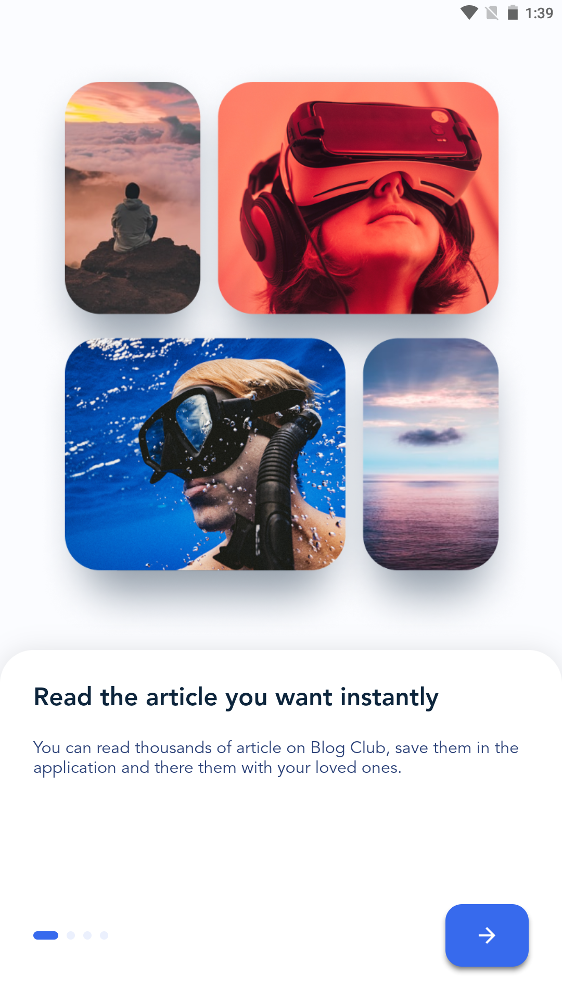
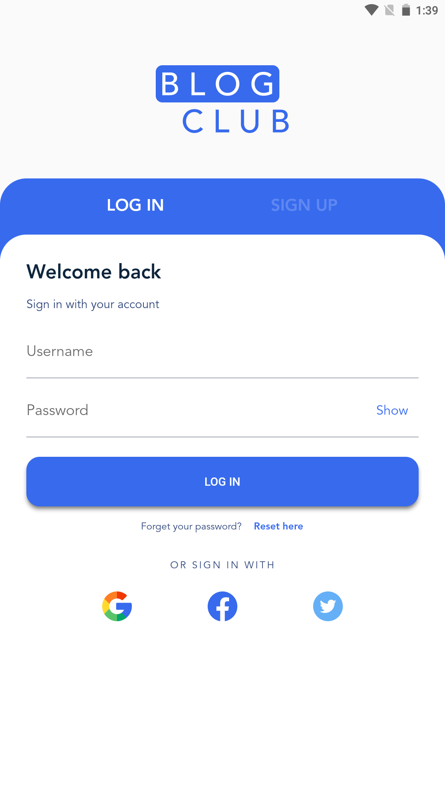
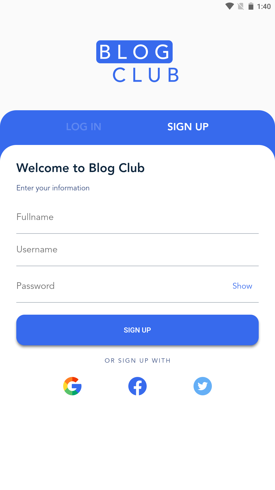
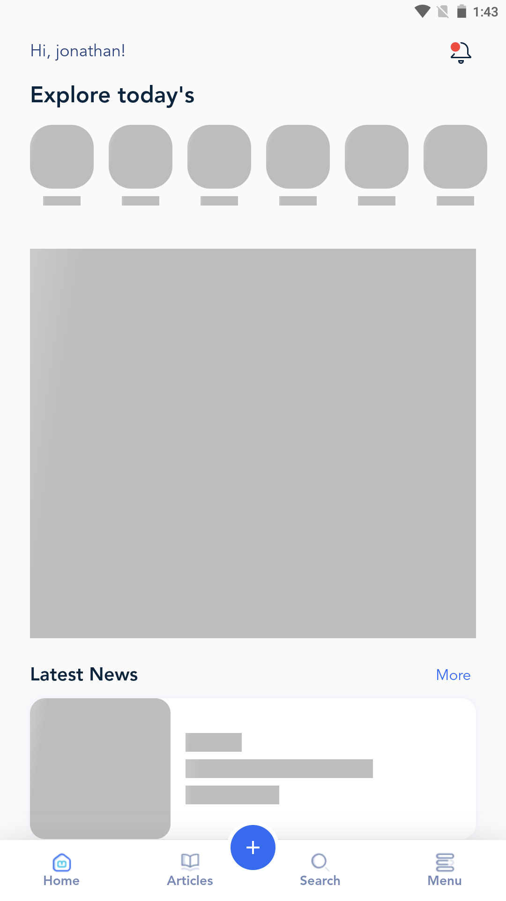
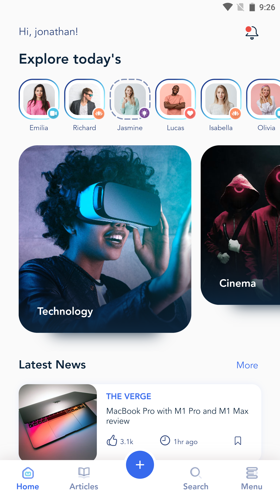
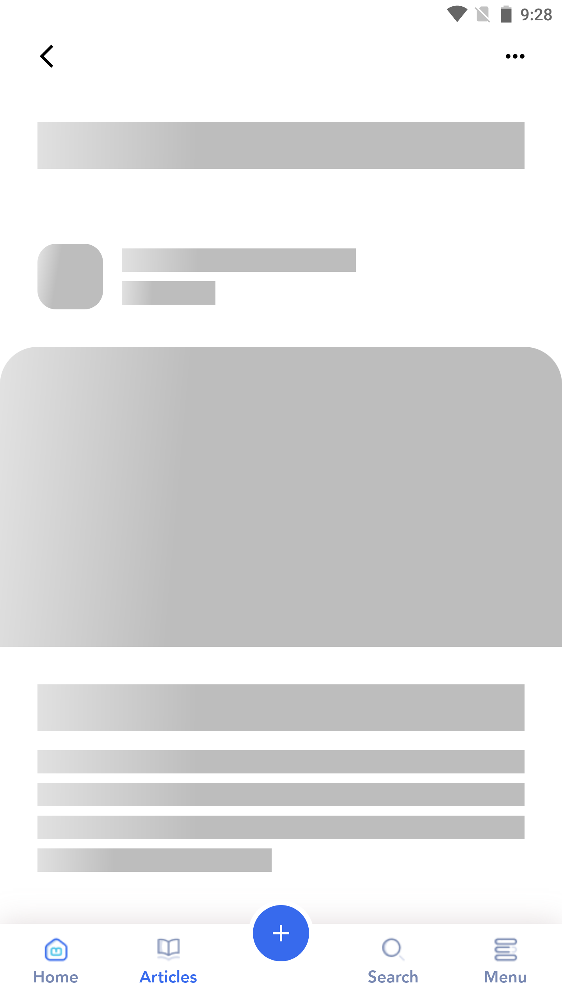
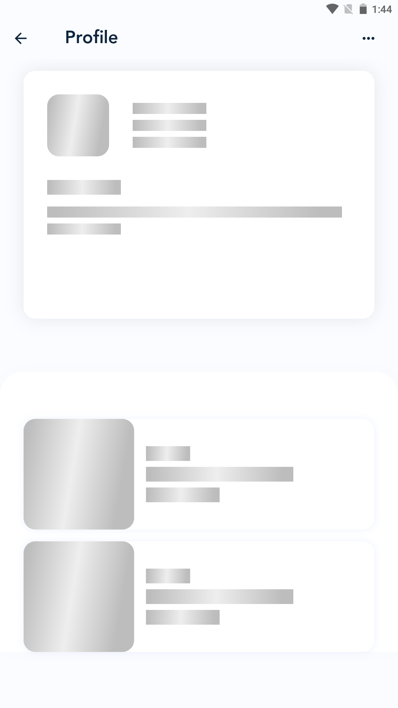
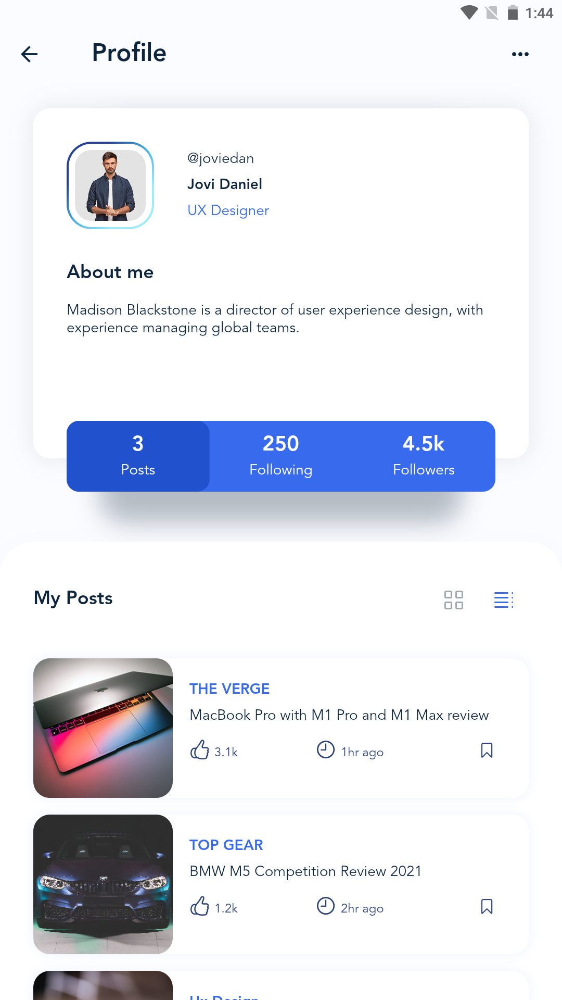

## Blog Club | Flutter UI Challenge

Create navigation like Instagram app navigation
Increase performance and reduce memory consumption when scrolling between pages.

Technologies

Technologies that are used in this projects are:

    Flutter
    Flutter Bloc

## Screenshot

<table border>
    <tr>
        <th style="text-align:center">Splash Screen</th>
        <th style="text-align:center">OnBoarding Screen</th>
        <th style="text-align:center">Auth Screen | Log in</th>
        <th style="text-align:center">Auth Screen | Sign up</th>
    </tr>
    <tr>
        <td></td>
        <td></td>
        <td></td>
        <td></td>
    <tr>
</table>

<table border>
    <tr>
        <th style="text-align:center">Home Screen | Loading</th>
        <th style="text-align:center">Home Screen</th>
        <th style="text-align:center">Article Screen | Loading</th>
        <th style="text-align:center">Article Screen</th>
    </tr>
    <tr>
        <td></td>
        <td></td>
        <td></td>
        <td></td>
    <tr>
</table>

<table border>
    <tr>
        <th style="text-align:center">Profile Screen | Loading</th>
        <th style="text-align:center">Profile Screen</th>
    </tr>
    <tr>
        <td></td>
        <td></td>
    <tr>
</table>
